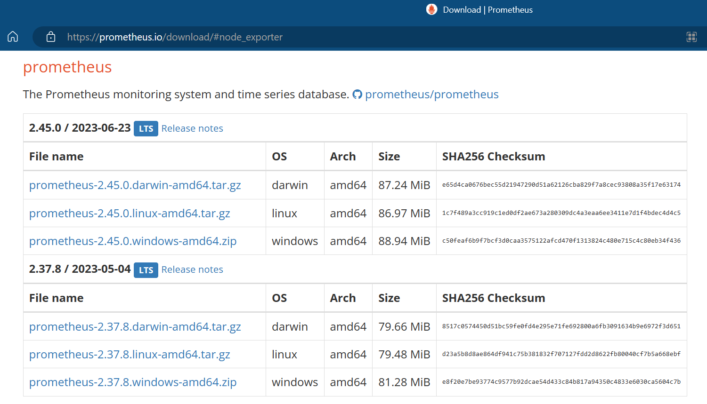
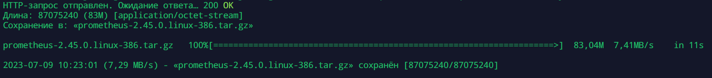
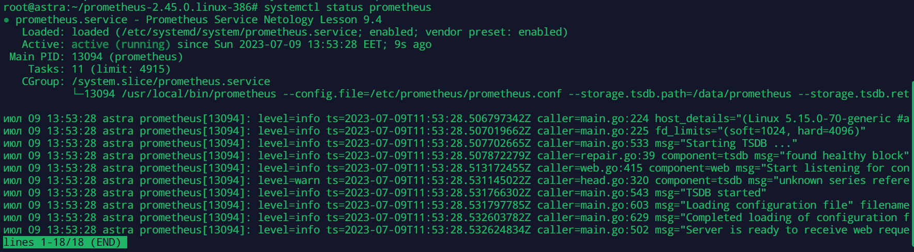

# Домашнее задание к занятию «Система мониторинга Prometheus»

---

### Задание 1
Установите Prometheus.

#### Процесс выполнения
1. Выполняя задание, сверяйтесь с процессом, отражённым в записи лекции
2. Создайте пользователя prometheus
3. Скачайте prometheus и в соответствии с лекцией разместите файлы в целевые директории
4. Создайте сервис как показано на уроке
5. Проверьте что prometheus запускается, останавливается, перезапускается и отображает статус с помощью systemctl

#### Требования к результату
- [ ] Прикрепите к файлу README.md скриншот systemctl status prometheus, где будет написано: prometheus.service — Prometheus Service Netology Lesson 9.4 — [Ваши ФИО]

---

### Порядок выполнения

1. Создаем пользователя

`sudo useradd --no-create-home --shell /bin/false prometheus`

2. Переходим на репозиторий 

[git:Prometheus](https://github.com/prometheus/prometheus/releases/)

или

[prometheus](https://prometheus.io/download/#node_exporter)

и скачиваем последний релиз, в соответствии с нашей системой

`wget https://github.com/prometheus/prometheus/releases/download/v2.45.0/prometheus-2.45.0.linux-386.tar.gz`

3. Распаковываем скачанный архив и размещаем по целевым каталогам

`tar xaf prometheus-2.45.0.linux-386.tar.gz`

`mv prometheus-2.45.0.linux-386 /data/prometheus`

   Настраиваем права на файлы для пользователя prometheus

`chown -R prometheus:prometheus /etc/prometheus /var/lib/prometheus`

`chown prometheus:prometheus /usr/local/bin/prometheus`

`chown prometheus:prometheus /usr/local/bin/promtool `

4. Создаем сервис
  
`nano /etc/systemd/system/prometheus.service`

[prometheus.service](./hw-04-1-prometheus-service.yml)

   Включаем сервис и запускаем

`systemctl start prometheus.service`

`systemctl enable prometheus.service`

5. Проверяем сервис 

`systemctl status prometheus.service`

