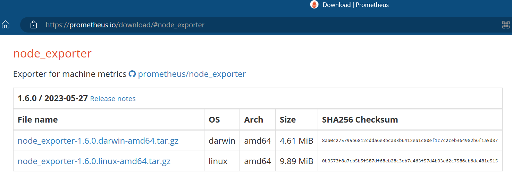
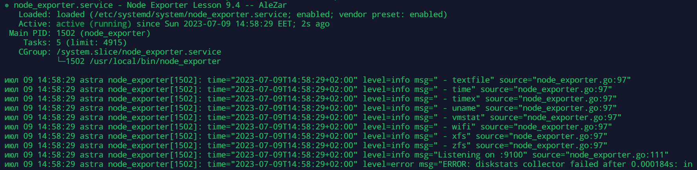

# Домашнее задание к занятию «Система мониторинга Prometheus»

---

### Задание 2
Установите Node Exporter.

#### Процесс выполнения
1. Выполняя ДЗ сверяйтесь с процессом отражённым в записи лекции.
3. Скачайте node exporter приведённый в презентации и в соответствии с лекцией разместите файлы в целевые директории
4. Создайте сервис для как показано на уроке
5. Проверьте что node exporter запускается, останавливается, перезапускается и отображает статус с помощью systemctl

#### Требования к результату
- [ ] Прикрепите к файлу README.md скриншот systemctl status node-exporter, где будет написано: node-exporter.service — Node Exporter Netology Lesson 9.4 — [Ваши ФИО]

---

### Порядок выполнения

_делаем на целевой машине, откуда собираемся получать метрики_

1. Переходим на 

и скачиваем node_exporter

`wget https://github.com/prometheus/node_exporter/releases/download/v*/node_exporter-*.*-amd64.tar.gz`

2. расспаковываем архив:

`tar xvfz node_exporter-*.*-amd64.tar.gz`

3. переходим в каталог и запускаем node_exporter

`cd node_exporter-*.*-amd64`

`./node_exporter`

4. Проверяем получение метрик:

`curl http://localhost:9100/metrics`

или, с фильтрацией по "node_"

`curl http://localhost:9100/metrics | grep "node_"`

5. Настраиваем наш Prometheus на получение метрик с node_exporter'а

`nano /etc/prometheus/prometheus.conf`

[prometheus-job](./prometheus-job.yml)

6. создание и установка сервиса node_exporter

 - _создаем сервис_

`nano /etc/systemd/system/node_exporter.service`

[node_exporter.service](./node_exporter.yml)

 - _запускаем сервис, проверяем и включаем_

`systemctl start node_exporter.service`

`systemctl status node_exporter.service`

`systemctl enable node_exporter.service`

