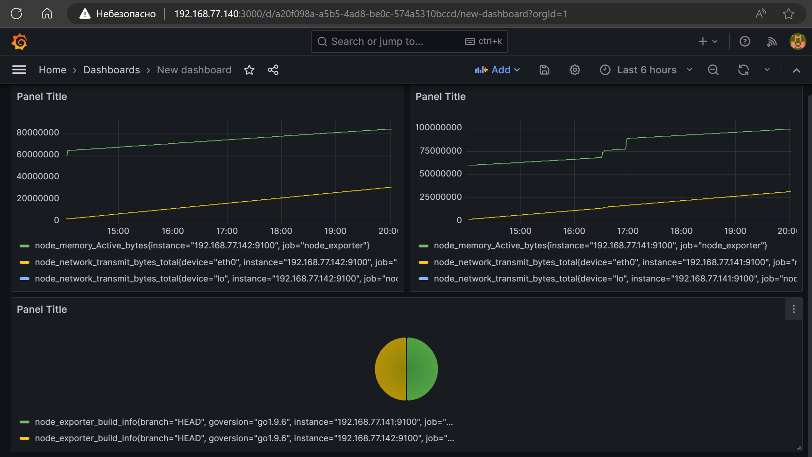

# Домашнее задание к занятию «Система мониторинга Prometheus»

---
## Дополнительные задания со звёздочкой*
Эти задания дополнительные. Их можно не выполнять. Это не повлияет на зачёт. Вы можете их выполнить, если хотите глубже разобраться в материале.

---
### Задание 4*
Установите Grafana.

#### Требования к результату
- [ ] Прикрепите к файлу README.md скриншот левого нижнего угла интерфейса, чтобы при наведении на иконку пользователя были видны ваши ФИО

---

### Порядок выполнения

С официального [сайта Grafana](https://grafana.com/grafana/download) берем нужный дистрибутив

выбираем параметры нашей системы, на которую будем устанавливать

Ubuntu and Debian(64 Bit)SHA256: 01bacb55af140ad7bddc9b21732c665d87b868232d5384027846abb30fd284ae

`sudo apt-get install -y adduser libfontconfig1`

`wget https://dl.grafana.com/enterprise/release/grafana-enterprise_10.0.1_amd64.deb`

`sudo dpkg -i grafana-enterprise_10.0.1_amd64.deb`

больше информации в руководстве по установке: [installation guide](https://grafana.com/docs/grafana/latest/setup-grafana/installation/debian/#2-start-the-server)

в результате Grafana установлена

Создаем дашборд и проверяем поступление данных от наших node_exporter'ов

 
