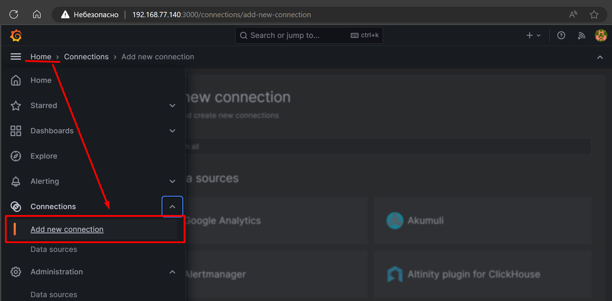
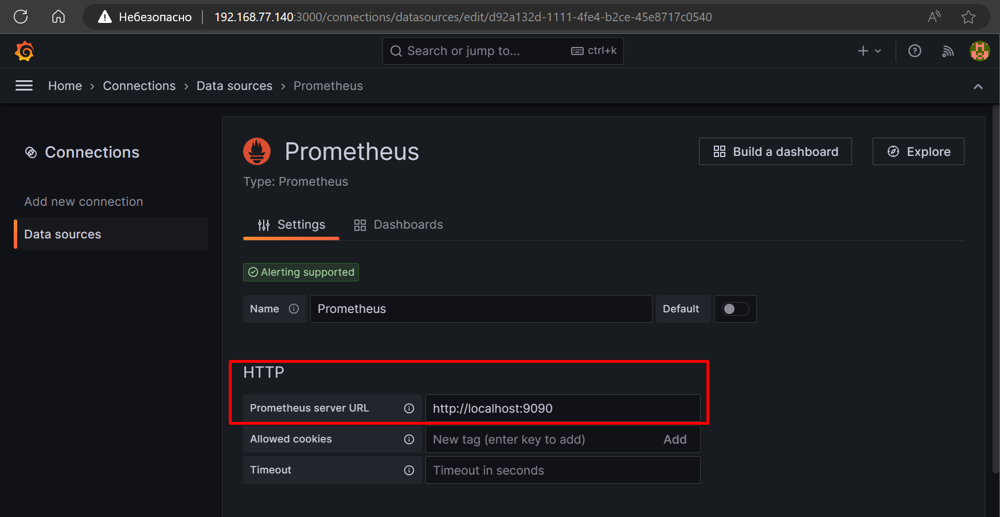
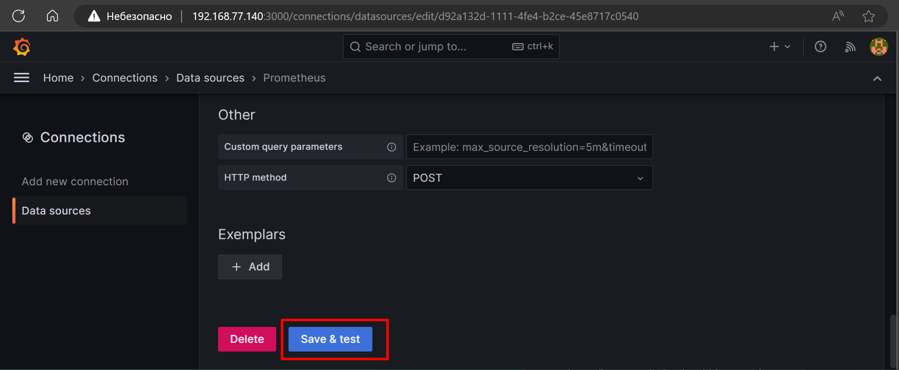
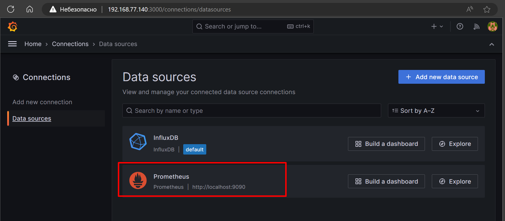
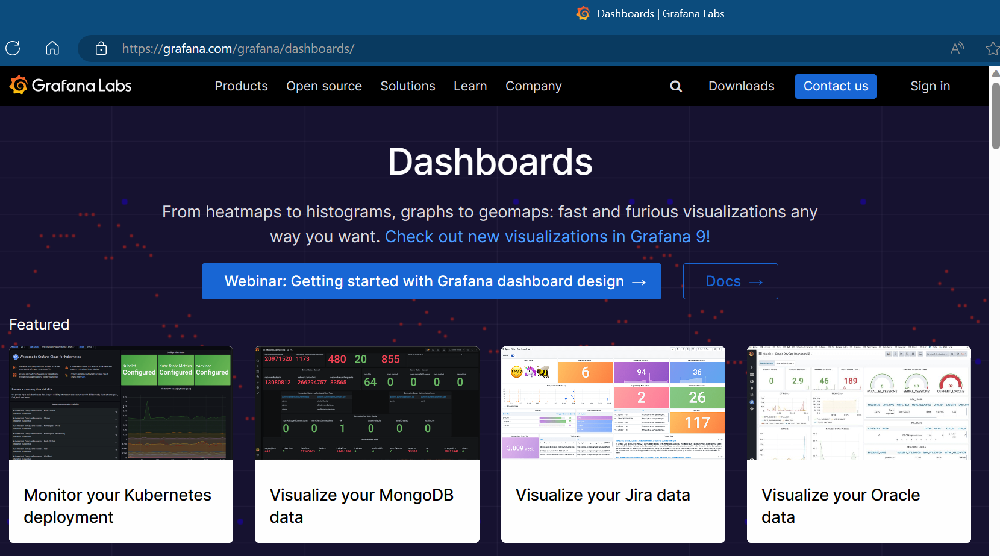
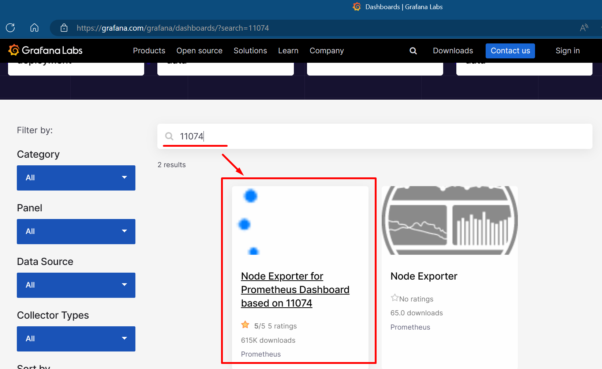
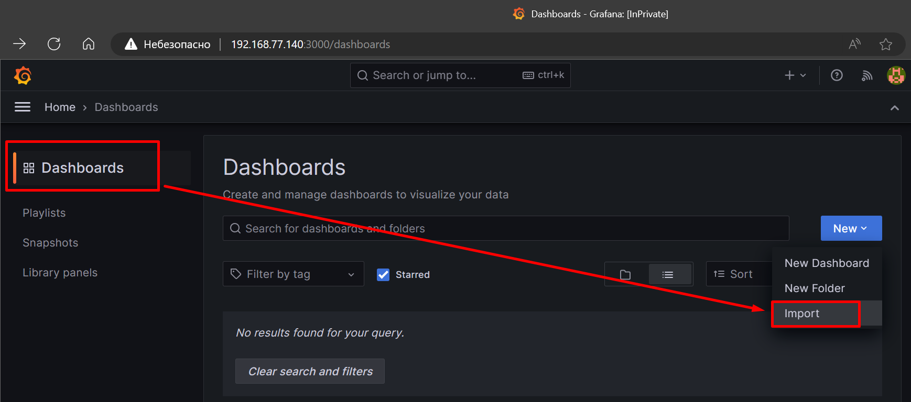
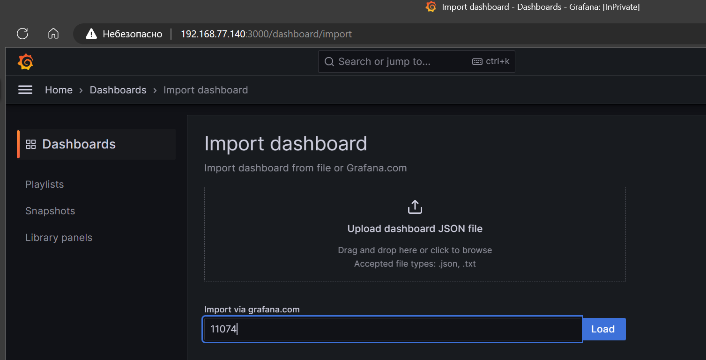
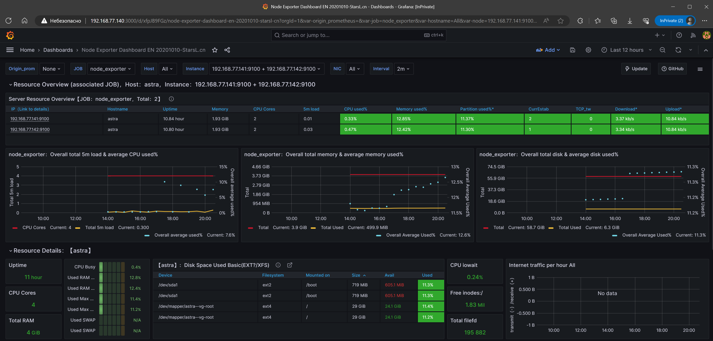
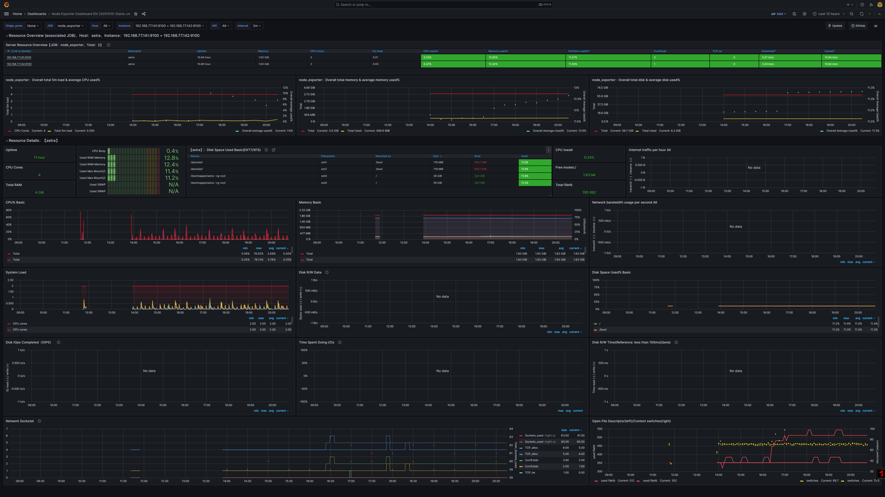

# Домашнее задание к занятию «Система мониторинга Prometheus»

---
## Дополнительные задания со звёздочкой*
Эти задания дополнительные. Их можно не выполнять. Это не повлияет на зачёт. Вы можете их выполнить, если хотите глубже разобраться в материале.

---
### Задание 5*
Интегрируйте Grafana и Prometheus.

#### Требования к результату
- [ ] Прикрепите к файлу README.md скриншот дашборда (ID:11074) с поступающими туда данными из Node Exporter

---

### Порядок выполнения

Подключаем Prometheus к Grafana

Указываем данные Prometheus'а

сохраняем и тестируем подключение

С сайта Grafana-дашбордов [Grafana:Dashboards](https://grafana.com/grafana/dashboards)

в поисковой строке вбиваем искомый ID:11074

и скачиваем дашборд ID:11074 и импортируем в нашу Grafana

либо ищем, скачиваем и импортируем дашборд в нашей Grafana 

результат:

FullScreen Dashboard

